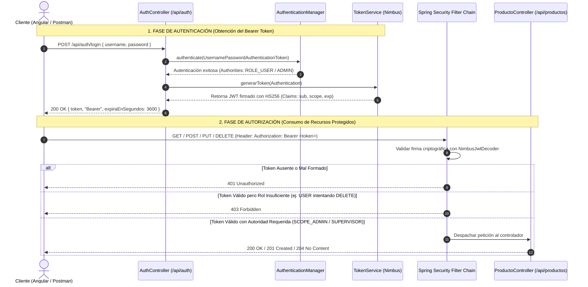

# 🔐 Enterprise Security API: Spring Security 6, OAuth2 Resource Server & Nimbus JWT (Lab 05)

[](https://spring.io/projects/spring-security)
[](https://spring.io/projects/spring-boot)
[](https://oauth.net/2/)
[](https://jwt.io/)
[](https://developer.mozilla.org/es/docs/Web/HTTP/CORS)
[](https://en.wikipedia.org/wiki/Stateless_protocol)
[](LICENSE)

> **Repositorio de Portafolio Profesional** desarrollado para la asignatura *Soluciones Web y Aplicaciones Distribuidas* (Universidad Privada del Norte). Implementa una arquitectura de seguridad integral para APIs REST y microservicios mediante **Spring Security 6**, **OAuth2 Resource Server**, **Tokens JWT Bearer firmados criptográficamente (HS256)** y políticas **CORS** para aplicaciones Single Page Application (SPA).

---

## 📌 Resumen Ejecutivo para Reclutadores Técnicos / RRHH

En ecosistemas cloud-native y arquitecturas de microservicios, el control de acceso no debe depender de sesiones en memoria del servidor (`HttpSession` / `JSESSIONID`), ya que dificulta el escalamiento horizontal. Este proyecto demuestra:
1. **Arquitectura Sin Estado (Stateless)**: Sesiones desacopladas (`SessionCreationPolicy.STATELESS`) donde la identidad y los privilegios viajan de manera compacta y autónoma en un **JSON Web Token (RFC 7519)**.
2. **Spring Security 6 y OAuth2 Resource Server**: Configuración moderna declarativa basada en componentes y expresiones lambda (`SecurityFilterChain`), superando las clases obsoletas de versiones anteriores.
3. **Criptografía Robusta**: Firma simétrica HMAC-SHA256 mediante la biblioteca `Nimbus JOSE + JWT` con validación estricta de claims (`iss`, `sub`, `iat`, `exp`, `scope`).
4. **Control de Acceso Basado en Roles (RBAC)**: Distinción formal entre autenticación (*"¿quién eres?"*) y autorización (*"¿qué puedes hacer?"*), implementando tres perfiles (`USER`, `SUPERVISOR`, `ADMIN`) bajo el Principio de Menor Privilegio (PoLP).
5. **Preparación para Frontend (CORS)**: Habilitación segura de Cross-Origin Resource Sharing restringida al origen `http://localhost:4200` (Angular), permitiendo cabeceras de autorización y negociación de credenciales.

---

## 🏛️ Flujo Criptográfico de Autenticación y Autorización



---

## 👥 Matriz de Control de Acceso (RBAC)

| Endpoint | Método HTTP | USER (`alumno`) | SUPERVISOR (`supervisor`) | ADMIN (`admin`) | Anónimo (Sin Token) |
| :--- | :---: | :---: | :---: | :---: | :---: |
| `/api/auth/login` | `POST` | ✅ Permitido | ✅ Permitido | ✅ Permitido | ✅ Permitido |
| `/api/productos` | `GET` | ✅ Permitido | ✅ Permitido | ✅ Permitido | ❌ `401 Unauthorized` |
| `/api/productos/{id}` | `GET` | ✅ Permitido | ✅ Permitido | ✅ Permitido | ❌ `401 Unauthorized` |
| `/api/productos/{id}` | `PUT` | ❌ `403 Forbidden` | ✅ Permitido *(Reto)* | ✅ Permitido | ❌ `401 Unauthorized` |
| `/api/productos` | `POST` | ❌ `403 Forbidden` | ❌ `403 Forbidden` | ✅ Permitido | ❌ `401 Unauthorized` |
| `/api/productos/{id}` | `DELETE` | ❌ `403 Forbidden` | ❌ `403 Forbidden` | ✅ Permitido | ❌ `401 Unauthorized` |

---

## 🔒 Credenciales de Prueba y Configuración Criptográfica

| Usuario | Contraseña | Roles Asignados | Scopes JWT Generados | Propósito |
| :--- | :--- | :--- | :--- | :--- |
| `alumno` | `Alumno123*` | `ROLE_USER` | `SCOPE_USER` | Consulta y lectura de inventario |
| `supervisor` | `Supervisor123*` | `ROLE_SUPERVISOR` | `SCOPE_SUPERVISOR` | Consulta y actualización (`PUT`) de inventario |
| `admin` | `Admin123*` | `ROLE_ADMIN` | `SCOPE_ADMIN` | Control total del inventario (CRUD completo) |

- **Algoritmo de Firma**: HMAC-SHA256 (`MacAlgorithm.HS256`).
- **Tiempo de Expiración**: 3600 segundos (1 hora).
- **Emisor (`iss`)**: `upn-laboratorio05`.
- **CORS**: Origen permitido `http://localhost:4200`, métodos `GET, POST, PUT, DELETE, OPTIONS`, cabeceras `Authorization, Content-Type`, credenciales permitidas.

---

## 🧪 Pruebas Automatizadas con MockMvc y Spring Security Test

El proyecto incluye la suite de pruebas `SecurityAuthCorsIntegrationTest.java` que demuestra de manera 100% automatizada:
- ✅ Rechazo de credenciales inválidas en login (`401 Unauthorized`).
- ✅ Generación y estructura de token JWT para credenciales válidas (`200 OK`).
- ✅ Bloqueo de endpoints protegidos al invocarse sin cabecera `Authorization` (`401 Unauthorized`).
- ✅ Consulta autorizada para roles `USER`, `SUPERVISOR` y `ADMIN` (`200 OK`).
- ✅ Bloqueo de operaciones de modificación para `USER` (`403 Forbidden`).
- ✅ Capacidad de actualización (`PUT`) para rol `SUPERVISOR` (`200 OK`).
- ✅ Denegación de eliminación (`DELETE`) para rol `SUPERVISOR` (`403 Forbidden`).
- ✅ Ejecución de operaciones privilegiadas (`POST`, `DELETE`) para rol `ADMIN` (`201 Created`, `204 No Content`).
- ✅ Verificación de pre-flight `OPTIONS` con cabeceras CORS desde `http://localhost:4200`.

Ejecución de tests:
```powershell
mvn test
```

---

## 🚀 Guía de Despliegue y Comprobación

```powershell
# 1. Compilar y ejecutar la aplicación
mvn spring-boot:run

# 2. Login como ADMIN para obtener token
$loginAdmin = curl.exe -s -X POST http://localhost:8080/api/auth/login `
  -H "Content-Type: application/json" `
  -d '{"username":"admin","password":"Admin123*"}' | ConvertFrom-Json

$adminToken = $loginAdmin.token

# 3. Crear un producto con token ADMIN (201 Created)
curl.exe -i -X POST http://localhost:8080/api/productos `
  -H "Authorization: Bearer $adminToken" `
  -H "Content-Type: application/json" `
  -d '{"nombre":"Monitor Curvo 27","categoria":"Monitores","precio":1299.90,"stock":7}'

# 4. Intentar consultar sin token (401 Unauthorized)
curl.exe -i http://localhost:8080/api/productos
```

---

## 💡 Preguntas de Análisis y Respuestas Técnicas (Guía UPN)

1. **¿Qué diferencia existe entre autenticación y autorización?**
   *Respuesta:* La autenticación verifica la identidad del usuario (*"¿quién eres?"* mediante credenciales), mientras que la autorización determina los permisos y privilegios del usuario autenticado (*"¿qué acciones puedes ejecutar?"* según sus roles/scopes).
2. **¿Por qué una API con JWT suele configurarse como STATELESS?**
   *Respuesta:* Porque elimina la necesidad de sincronizar sesiones entre múltiples nodos en arquitecturas distribuidas. Toda la información necesaria para autorizar la petición viaja dentro del propio token firmado.
3. **¿Cuál es la diferencia entre 401 Unauthorized y 403 Forbidden?**
   *Respuesta:* `401 Unauthorized` indica que el cliente no ha proporcionado credenciales válidas o el token ha expirado. `403 Forbidden` significa que el servidor reconoce la identidad del cliente, pero este carece de los privilegios necesarios para realizar la operación solicitada.
4. **¿Qué información transporta el token JWT en este laboratorio?**
   *Respuesta:* Transporta claims estándar como emisor (`iss`), fecha de emisión (`iat`), expiración (`exp`), sujeto/usuario (`sub`) y claims personalizados como `scope` (lista de roles convertidos a authorities).
5. **¿Por qué CORS no reemplaza a Spring Security?**
   *Respuesta:* CORS es una política de seguridad aplicada exclusivamente por el navegador web para restringir qué dominios pueden hacer peticiones asíncronas. No protege la API de llamadas directas desde herramientas como cURL, Postman o scripts maliciosos; Spring Security es la barrera que autentica y autoriza en el servidor.

---

## 👤 Autor
**Orlando Dorival**  
Estudiante de Ingeniería de Sistemas Computacionales  
Universidad Privada del Norte (UPN) | Universidad Nacional de Ingeniería (UNI)  
GitHub: [@Orlandho](https://github.com/Orlandho)
